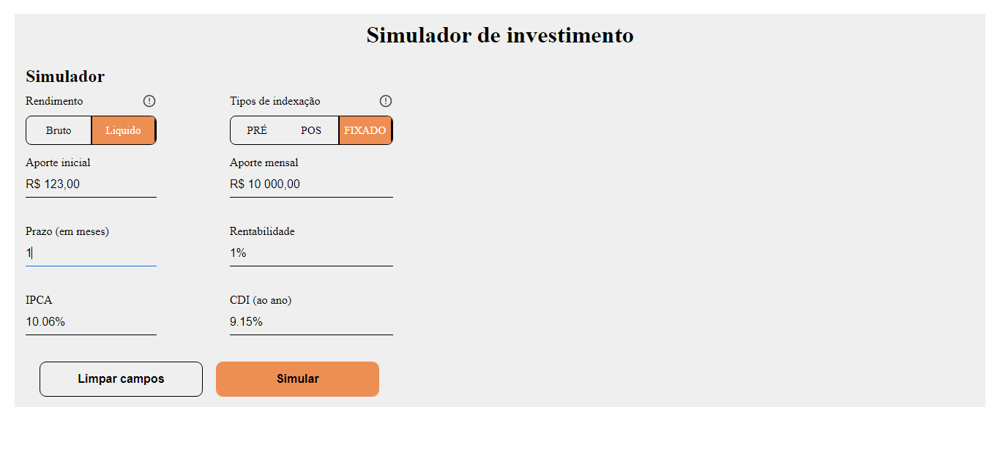

<h1 align="center">Desafio front-end / eqi-investimentos</h1>

## Oque é este repositório?

Trata-se de um desafio proposto pela empresa EQI-Investimentos para a criação do front-end de um Simulador de Investimentos

## Tecnologias utilizados

- **ReactJS**: Pela componentização de elementos e organização do código
- **ChartJS**: Para apresentar um gráfico com os dados
- **Axios**: Para as requisições HTTP
- **Storybook**: Para documentar a aplicação
- **Jest**: Para desenvolver os testes unitários
- **Cypress**: Para desenvolver teste E2E
- **Testing-library**: Pela possibilidade de ler a DOM de componentes React em testes

## Screenshots


Os inputs só podem receber numeros


Se todos os inputs estiverem preencidos corretamente o botão de Simular será habilitado


Esssa é a tela de resultados se tudo ocorrer corretamente

## Requisitos minimos

Ter o [NodeJS](https://nodejs.org/en/) instalado na sua maquina

Seguir os passos de como executar o servidor fake no repositório [fake-api](https://github.com/eqi-investimentos/desafio-fake-api#como-executar)

## Como executar

Clone este repositório em sua maquina

Abra-o em um editor de código e execute `npm install`

Logo após a instalações de todas as dependências, execute `npm start`

A aplicação pode ser acessada em http://localhost:3001/

## Outras Task Runners

```bash
npm test
  # Executa os testes unitários
npm run storybook
  # Executa a documentação do projeto na url http://localhost:6006/
npm run cypress
  # Executa os testes E2E
  # Atenção: a aplicação já deve estar sendo executada
npm build
  # Faz o bundle da aplicação para produção
```
